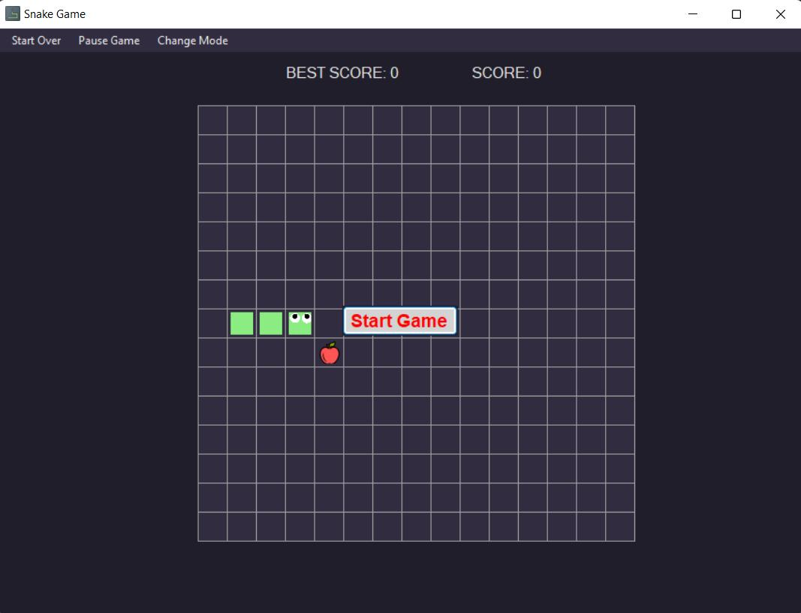

# SnakeGame
Snake Game направена од: Сања Василова, Ивана Пенкова и Анастасија Лалкова

## Опис на играта

Играта „Snake" функционира на следниов начин: играчот контролира змија која се движи на екран. Целта е змијата да се движи и да јаде храна која се појавува на различни места на екранот и доколку не ја изеде истата во рок од 5 секунди, нејзината позиција се менува. Со секое јадење, змијата станува подолга. Играчот мора да внимава змијата да не се судри со ѕидовите на екранот или со својот сопствен опаш, бидејќи тоа завршува со крај на играта. Играта завршува и кога змијата ќе исполни 50% од екранот, што значи победа. Имаме променливи score и bestScore. Score се зголемува при секое јадење на храната и при секоја нова игра се ресетира, додека во bestScore се чува најдобриот score од изиграните игри.


## Опис на решението на проблемот

Нашиот проблем го решивме користејќи ги следните класи и функции:
- Форма: Имаме табела која означува координатен систем, каде што координатата (0, 0) се наоѓа на горниот лев агол
- GridValue: енумерација на можните вредности на координатите (Empty, Snake, Apple, Out, DeadBody, DeadHead)
- Position: класа која ја користиме за да доделиме координати на одредена позиција
- Direction: класа во која се чуваат можните насоки на змијата (Left, Right, Up, Down)
- Images: класа која ги содржи сликите кои ги користиме за да ја исцртаме табелата, змијата и храната
- GameState: класа во која се чува моменталната состојба на играта, во неа ја исцртуваме змијата, ја движиме, ги правиме потребните модификации при движење на истата, ја додаваме храната на случајна позиција и ги правиме проверките дали змијата се наоѓа на валидна позиција и дали сме победиле во играта
- Класата на формата: Во формата ја чуваме состојбата на играта, за секои 300ms ја придвижуваме змијата, ја исцртуваме табелата користејќи ги претходно наведените слики и при секој клик на стрелките на тастатурата имаме промена на насоката на змијата, доколку истата е валидна.

## Опис на класата GameState

### Иницијализација на променливи и конструктор:
```angular2html
 public int Rows { get; set; }
 public int Columns { get; set; }
 public GridValue[,] Grid { get; set; }
 public Direction Dir { get; set; }
 public int Score { get; set; }
 public bool GameOver { get; set; }
 public int generateApple = 5000;

 private LinkedList<Position> snakePosition = new LinkedList<Position>();
 private Random random = new Random();

 public GameState(int rows, int cols)
 {
     Rows = rows;
     Columns = cols;
     Grid = new GridValue[Rows, Columns];
     Dir = Direction.Right;

     AddSnake();
     AddFood();
 }
```
Иницијализираме 6 променливи:
- Rows и Columns го означуваат бројот на редови и колони на табелата соодветно, Score го означува моменталниот резултат на играта, додека generateApple ги означува милисекундите за ресетирање на позицијата на јаболкото. Сите четири проментливи се од тип integer.
- Grid која претставува дводимензионална низа, објект од класата GridValue
- Dir претставува објект на класата Direction
- GameOver е од тип boolean и ако нејзината вредност е true што значи дека играта е завршена
- snakePosition претставува листа од позиции (објекти од типот Position) на змијата во играта. 
- random претставува објект од класата Random кој се користи за генерирање на случајни броеви во играта.

Имаме конструктор за класата GameState, кој прима два аргументи (rows и cols) за бројот на редови и колони во табелата за игра. Во овој конструктор се иницијализираат сите променливи и се поставуваат почетните вредности за да се започне со играта.
Во конкретниот пример, конструкторот иницијализира табела (Grid) со димензии според добиените аргументи (rows и cols), поставува правец на движење (Dir) и додава змија (AddSnake) и храна (AddFood) во играта како почетни елементи. Овие елементи и својства го определуваат стартот и состојбата на играта која може да се имплементира со оваа класа GameState.

### Методот AddSnake():
```angular2html
private void AddSnake()
{
    int r = Rows / 2;

    for (int c = 1; c <= 3; c++)
    {
        Grid[r, c] = GridValue.Snake;
        snakePosition.AddFirst(new Position(r, c));
    }
}
```
Функцијата AddSnake() служи за исцртување на змијата во табелата за игра. Змијата се става на средината на редовите и се состои од три дела распоредени во десниот правец. Секое место во табелата Grid, каде што змијата се наоѓа, се означува како GridValue.Snake. Истовремено, позициите на секој дел од змијата се зачувуваат во листата snakePosition, што им овозможува на деловите на змијата да се движат и да се контролираат во текот на играта.

### Методот AddFood():
```angular2html
private void AddFood()
{
    List<Position> empty = new List<Position>(EmptyPositions());

    if (empty.Count == 0)
    {
        return;
    }

    Position position = empty[random.Next(empty.Count)];
    Grid[position.Row, position.Column] = GridValue.Apple;

    var timer = new System.Timers.Timer(generateApple);
    timer.Elapsed += (sender, e) =>
    {
        if (Grid[position.Row, position.Column] == GridValue.Apple)
        {
            Grid[position.Row, position.Column] = GridValue.Empty;
            AddFood();
        }
    };
    timer.Start();
}
```
Функцијата AddFood() случајно поставува јаболко во табелата за игра на празна позиција. Ако нема празни позиции, не се додава јаболко. Поставеното јаболко ја означува со вредноста GridValue.Apple во табелата Grid. Потоа, се стартува тајмер кој ќе го отстрани јаболкото по истекувањето на милисекундите зададени во променливата generateApple (5000ms=5s), доколку остане неизедено.

### Методот EmptyPositions():
```angular2html
 private IEnumerable<Position> EmptyPositions()
 {
     for (int r = 0; r < Rows; r++)
     {
         for (int c = 0; c < Columns; c++)
         {
             if (Grid[r, c] == GridValue.Empty)
             {
                 yield return new Position(r, c);
             }
         }
     }
 }
```

Функцијата EmptyPositions() ги враќа сите празни позиции во табелата за игра како еден IEnumerable на објекти од класата Position. Таа го проверува секое место во табелата и, ако е празно (GridValue.Empty), го враќа како позиција (Position).

### Функциите HeadPosition(), TailPosition(), SnakePositions():
```angular2html
public Position HeadPosition()
{
    return snakePosition.First.Value;
}

public Position TailPosition()
{
    return snakePosition.Last.Value;
}

public IEnumerable<Position> SnakePositions()
{
    return snakePosition;
}
```
HeadPosition(): Ја враќа позицијата на првиот дел (главата) на змијата.

TailPosition(): Ја враќа позицијата на последниот дел (опашот) на змијата.

SnakePositions(): Ги враќа сите позиции на змијата како колекција од објекти од класата Position.

### Методот AddHead(Position position):
```angular2html
private void AddHead(Position position)
{
    snakePosition.AddFirst(position);
    Grid[position.Row, position.Column] = GridValue.Snake;
}
```
Функцијата AddHead(Position position) додава нов дел (глава) на змијата во играта. Ја поставува новата позиција како прв елемент во листата snakePosition и го означува тоа место како дел од змијата во табелата Grid.

### Методот RemoveTail()
```angular2html
private void RemoveTail()
{
    Position tail = snakePosition.Last.Value;
    Grid[tail.Row, tail.Column] = GridValue.Empty;
    snakePosition.RemoveLast();
}
```
Функцијата RemoveTail() го отстранува последниот дел (опашот) од змијата во играта. Ја означува позицијата на опашот како празна во табелата Grid и ја отстранува од листата snakePosition, што го ажурира редоследот на деловите на змијата.

### Методот ChangeDirection(Direction direction)
```angular2html
public void ChangeDirection(Direction direction)
{
    if (Dir.IsOpposite(direction)) return;
    
    Dir = direction;
}
```

Функцијата ChangeDirection(Direction direction) ја менува насоката на движење на змијата во играта. Проверува дали новиот правец не е спротивен на тековниот и, ако не е, го ажурира правецот на змијата.

### Методот OutsideGrid(Position position)
```angular2html
private bool OutsideGrid(Position position)
{
    return position.Row < 0 || position.Row >= Rows || position.Column < 0 || position.Column >= Columns;
}
```

Функцијата OutsideGrid(Position position) проверува дали дадената позиција (position) е во границите на табелата за игра. Aко позицијата е надвор од било која од границите (редот е помал од 0 или поголем или еднаков на Rows, или колоната е помала од 0 или поголема или еднаква на Columns), враќа true; инаку, враќа false.

### Методот Hit(Position newHeadPosition)
```angular2html
private GridValue Hit(Position newHeadPosition)
{
    if (OutsideGrid(newHeadPosition))
    {
        return GridValue.Out;
    }

    if (newHeadPosition == TailPosition())
    {
        return GridValue.Empty;
    }

    return Grid[newHeadPosition.Row, newHeadPosition.Column];
}
```

Функцијата Hit(Position newHeadPosition) проверува дали новата позиција на главата на змијата удрила во некој објект во играта и враќа соодветна вредност од типот GridValue:

- Ако новата позиција е надвор од границите на табелата, враќа GridValue.Out.
- Ако новата позиција се совпаѓа со позицијата на репот на змијата, враќа GridValue.Empty.
- Во секој друг случај, враќа вредност од табелата Grid на новата позиција на главата на змијата.

### Методот Move()
```angular2html
public void Move()
{
    if (GameOver) return;

    Position newHeadPos = HeadPosition().Translate(Dir);
    GridValue hit = Hit(newHeadPos);

    if (hit == GridValue.Out || hit == GridValue.Snake)
    {
        foreach (var position in snakePosition)
        {
            Grid[position.Row, position.Column] = GridValue.DeadBody;
        }
        Grid[HeadPosition().Row, HeadPosition().Column] = GridValue.DeadHead;
        GameOver = true;
    }
    else if (hit == GridValue.Empty)
    {
        RemoveTail();
        AddHead(newHeadPos);
    }
    else if (hit == GridValue.Apple)
    {
        AddHead(newHeadPos);
        Score++;
        AddFood();
    }
}
```

Функцијата Move() се користи за да се изврши едно движење на змијата во играта. Во кратки црти:

- Се проверува дали играта е завршена (GameOver). Ако е така, функцијата завршува без дејствие.

- Се пресметува новата позиција на главата на змијата во одреден правец.

- Се проверува дали новата позиција удрила во некоја пречка, како ѕид (GridValue.Out), змија (GridValue.Snake), или ако е празна (GridValue.Empty).

- Во зависност од резултатот:

  - Ако удрила во ѕид или друга змија, змијата се означува како мртва и играта завршува (GameOver).
  - Ако резултатот бил празно место, се отстранува опашот на змијата и се додава нова глава на змијата на новата позиција.
  - Ако го изела јаболкото (GridValue.Apple), се додава нова глава на змијата, се зголемува бројот на поени (Score), и се додава ново јаболко.

Оваа функција игра клучна улога во движењето и интеракцијата на змијата со околината во играта.

### Методот CheckWinCondition()
```angular2html
public bool CheckWinCondition()
{
    int totalCells = Rows * Columns;
    int occupiedCells = 0;

    foreach (var value in Grid)
    {
        if (value == GridValue.Snake || value == GridValue.Apple)
        {
            occupiedCells++;
        }
    }

    double occupiedPercentage = (double)occupiedCells / totalCells;
    return occupiedPercentage >= 0.5; 
}
```
Функцијата CheckWinCondition() ја проверува состојбата на играта за да одреди дали играчот га исполнува условот за победа. Таа враќа true доколку 50% или повеќе од ќелиите во табелата се исполнети со змија и јаболко.

## Screenshots од изгледот на играта
### Почетниот изглед на играта е следниот:

### Упатство на користење:
Играта можеме да ја започнеме со кликање на копчето Start Game. Најгоре лево имаме мени со три опции:
- Start Over - Можеме играта да ја започнеме одпочеток
- Pause Game - Можеме да ја паузираме играта
- Change Mode - Можеме да го одбериме модот на играта(Easy, Medium, Hard)

  

 Доколку изгубиме (змијата ја удриме самата во себе или во ѕид) изгледот на екранот е следниот:


Доколку победиме (змијата исполнува 50% од табелата) изгледот на екранот е следниот:


Откако ќе победиме или изгубиме се појавува копче Start Over за повторно да ја започнеме играта.
 
